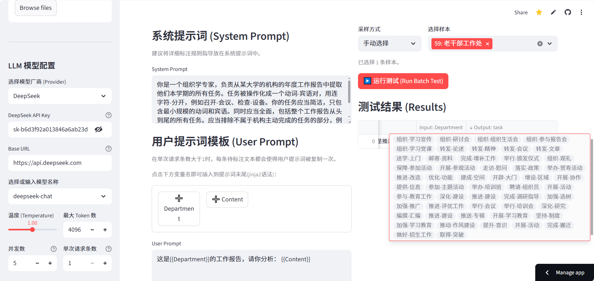

# VisAnnotator Lab - 计算社会科学标注实验台

  

**VisAnnotator Lab** 是一个专为计算社会科学研究者设计的“所见即所得” (WYSIWYG) 大模型文本标注实验台。它旨在弥合定性调试与定量生产之间的鸿沟，让您无需编写复杂的 Python 代码，即可利用大语言模型 (LLM) 进行大规模、高信度的文本分析。

## 🌟 核心理念

本项目旨在解决计算社会科学（CSS）研究中的两个核心痛点：
1.  **Prompt 调试困难**：传统的脚本式开发缺乏直观反馈，缺乏可视化的、交互式的调试工具，难以快速迭代 Prompt。
2.  **定量生产门槛高**：从 Demo 到大规模标注需要处理并发、JSON格式、错误重试、成本估算等工程问题，容易重复造轮子。

VisAnnotator Lab 通过可视化的界面，实现了从**定性调试**到**定量生产**的无缝衔接。


## 直接运行网页版：

https://visannotatorlab.streamlit.app/



## 🎯 核心功能

*   **可视化 Schema 定义**：通过 GUI 定义输出结构（String, Integer, Enum, Boolean, List），无需手写 JSON Schema。
*   **交互式 Prompt 调试**：实时查看 Prompt 对特定样本的输出效果，支持多 Prompt 配置管理与 A/B 测试。
*   **三种标注模式**：
    *   **标准模式 (Standard)**：适用于常规的分类、提取任务。
    *   **长文档分块模式 (Chunking)**：自动切分长文本（如政策文件），分别处理后合并结果，突破 Context Window 限制。
    *   **TrueSkill 比较模式 (TrueSkill)**：针对主观评分任务（如“创造性”），通过两两比较自动生成相对排名，消除定标偏差。
*   **信效度检验**：内置人工标注界面，自动计算 Cohen's Kappa 系数与准确率，符合学术要求。
*   **批量生产**：支持高并发批量标注，提供进度条与结果导出（CSV），并可生成离线 Python 脚本。

## 🚀 快速开始

### 1. 环境准备
确保您的电脑已安装 [Python 3.9](https://www.python.org/downloads/) 或更高版本。

### 2. 安装依赖
```bash
git clone https://github.com/your-repo/VisAnnotator.git
cd VisAnnotator
pip install -r requirements.txt
```

### 3. 启动应用
```bash
streamlit run app.py
```
启动后，浏览器会自动打开 `http://localhost:8501`。

## 📖 使用指南

### Step 1: 数据接入 (Data Ingestion)
上传 `.csv` 或 `.xlsx` 文件，系统会自动解析并展示预览。

### Step 2: 定义 (Define)
*   **Schema 编辑器**：定义您希望提取的变量。
    *   *提示*：若使用**分块模式**，Schema 需仅包含一个 List 变量。
    *   *提示*：若使用**TrueSkill模式**，Schema 需仅包含 Integer 变量（支持多个）。

*   **支持数据类型**：`String` (文本), `Integer` (整数/评分), `Boolean` (布尔), `Enum` (枚举选项), `List` (列表)。适用场景如下表：

| 数据类型 | Integer | String | Boolean | Enum | List |
| --- | --- | --- | --- | --- | --- |
| 场景举例 | 评分类任务，如文本的情绪强度 | 信息提取、主题分析等 | 二分类任务，如判断文本是否符合研究要求 | 分类任务或选择题，如多情绪分类等 | 复数信息提取任务，如实体识别、关系抽取、事件抽取等 |

*   **Prompt 工程**：编写 System Prompt 和 User Prompt，支持 `{{列名}}` 变量插入。

### Step 3: 调试与运行 (Playground)
*   **调试模式**：抽取少量样本（随机/关键词）进行测试，验证 Prompt 效果。
*   **高级设置**：在侧边栏开启“分块模式”或“TrueSkill模式”。
*   **生产模式**：全量运行。系统会自动估算 Token 成本，并在完成后提供 CSV 下载。

### Step 4: 评估 (Evaluation)
*   构建验证集并进行人工标注。
*   运行实验，对比不同 Prompt 配置与人工标注的一致性 (Cohen's Kappa)。

## ⚙️ 配置管理
*   **模型配置**：支持 OpenAI, DeepSeek, Claude, Gemini 等多种模型，可自定义 Base URL 和并发数。
*   **导入/导出**：将 Schema 和 Prompt 配置导出为 JSON 文件，方便分享或复用。

## 🏗️ 技术栈
*   **Frontend**: Streamlit
*   **Logic**: Python (Asyncio)
*   **LLM SDK**: OpenAI (AsyncOpenAI), Anthropic
*   **Algorithms**: Scikit-learn (Metrics), Trueskill (Ranking)

---
*Happy Researching!* 🧪